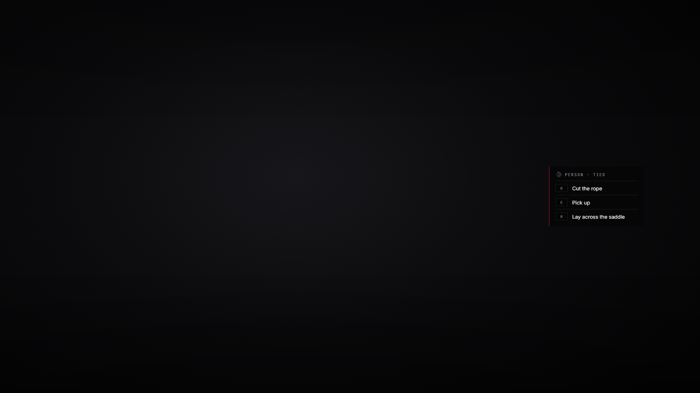

# lxr-lasso — Rope on people, for LXRCore

Players can be lassoed and hogtied the way the game does it with animals.
This resource sets the flag that allows it, keeps who is tied on the
server, and gives the tied everything the game can do with a hogtied body:
carried on a shoulder, laid across a saddle, put down, cut free with a
blade — or left to wriggle loose after a while. Hogtying by hand needs a
lasso or a rope in the satchel; `Config.Rope.lawOnly` keeps it to the law.



## What it does

* **Lasso** — the game's own rope works on players (`allowLasso`); the tied
  player's client reports the hogtie and the server keeps `state.tied`.
* **By hand** — the **Hogtie** option on a person (needs `lasso` or `rope`).
* **Carry** — pick up, put down, lay across your own horse (native carry
  tasks, synced by the game).
* **Free** — cut with any blade (`knifeToCut`), untie, or the tied press X
  after `escapeSeconds`.
* **Events** — `lxr:lasso:tied (src, on, by)`; the `tied` state bag is
  read by lxr-blindfold.

## Install

```cfg
ensure lxr-core
ensure lxr-interact
ensure lxr-lasso
```

## API

| Name | Side | Purpose |
|---|---|---|
| `IsTied(src)` · `Free(src)` | server | hooks |
| `IsTied()` | client | local mirror |

## Licence

© 2026 iBoss21 / LXRCore — All Rights Reserved. See `LICENSE`.
